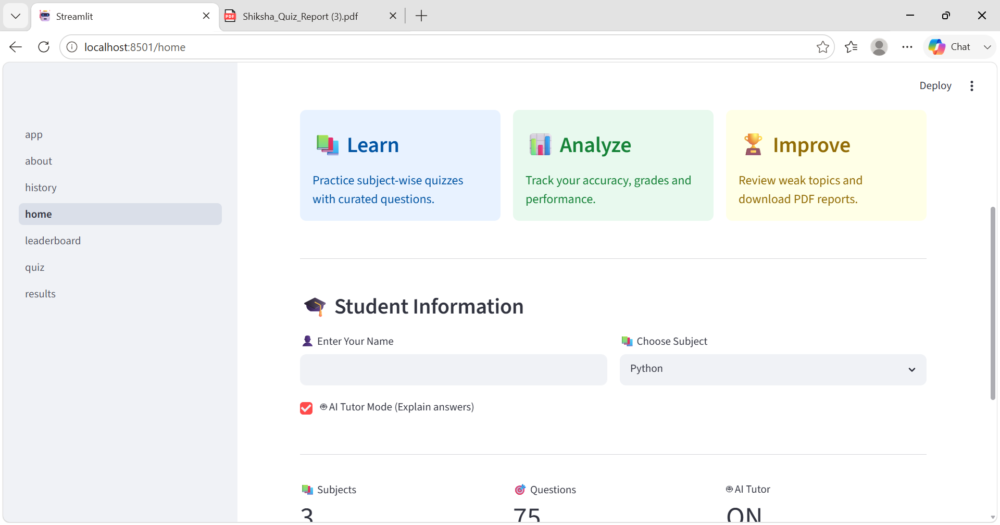
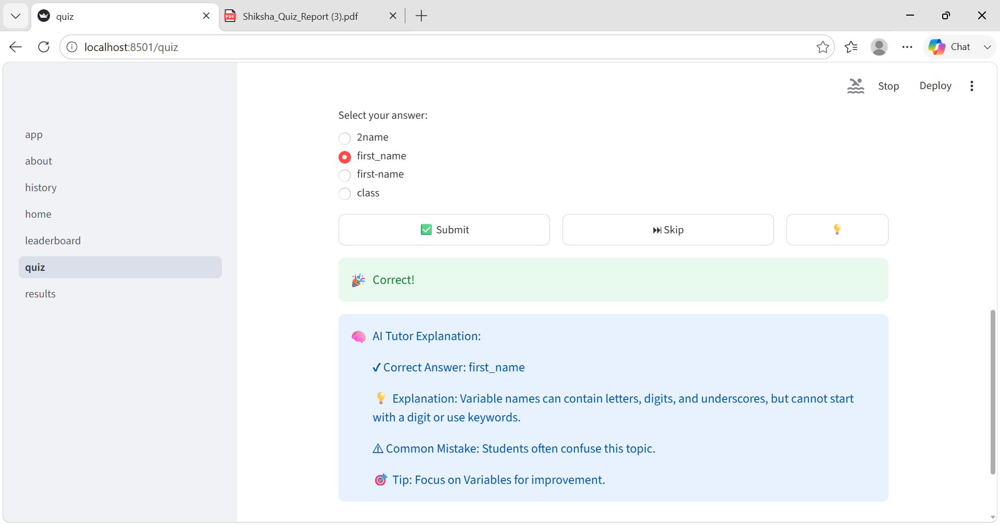
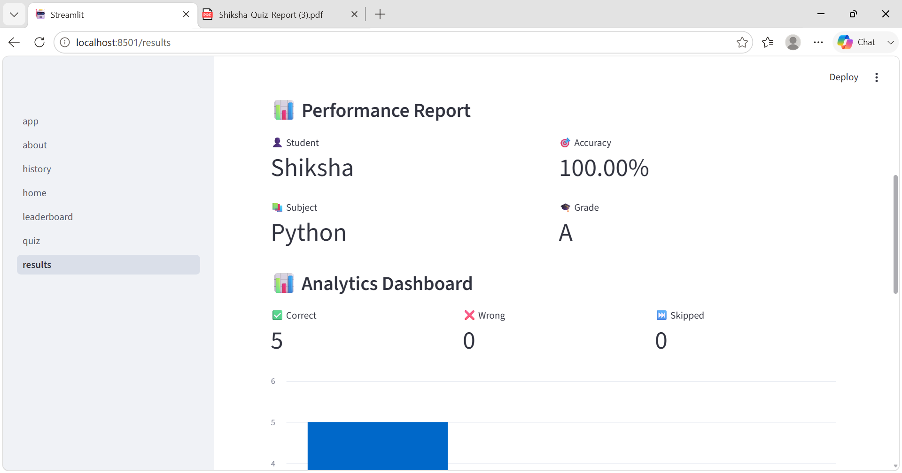
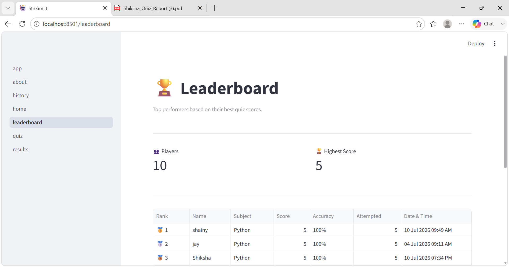
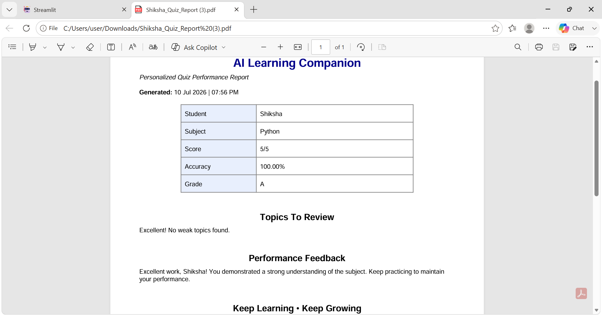
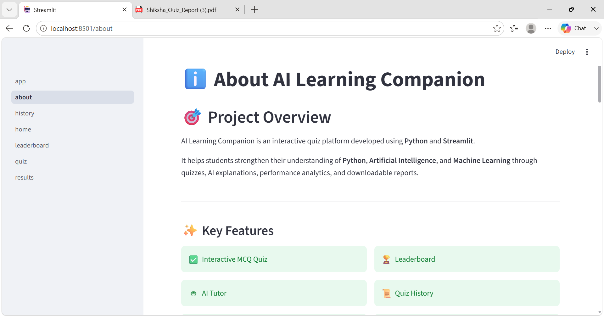

# 🤖 AI Learning Companion

[](https://ai-learning-companion-shiksha.streamlit.app)


An interactive AI-powered quiz application built with Python and Streamlit.

---

## 📌 Project Overview

AI Learning Companion provides an engaging way to practice technical concepts using multiple-choice quizzes. It offers instant feedback, AI tutor explanations, quiz history, leaderboards, and downloadable PDF reports.

---

## 🌐 Live Demo

👉 https://ai-learning-companion-shiksha.streamlit.app

---

## ✨ Features

- 🎯 Interactive MCQ Quiz
- 🤖 AI Tutor Mode
- 📊 Performance Analytics
- 🏆 Leaderboard
- 📜 Quiz History
- 📄 PDF Report Generation
- 💡 Hint System
- ⏭️ Skip & Revisit Questions
- 🗄 SQLite Database
- 📅 Timestamped Quiz Attempts

---

## 🛠 Tech Stack

| Technology | Purpose |
|------------|---------|
| Python | Core Programming |
| Streamlit | Web Application |
| SQLite | Database |
| ReportLab | PDF Generation |
| Matplotlib | Analytics Charts |
| Git & GitHub | Version Control |

---

## 📂 Project Structure

```text
AI-Learning-Companion/
│
├── app.py
├── database.py
├── questions.py
├── pdf_generator.py
│
├── pages/
│   ├── home.py
│   ├── quiz.py
│   ├── results.py
│   ├── history.py
│   ├── leaderboard.py
│   └── about.py
│
├── utils/
│   ├── session.py
│   ├── analytics.py
│   └── ai_tutor.py
│
├── leaderboard.txt
└── README.md
```

---

## 🚀 Installation

Clone the repository

```bash
git clone https://github.com/shikshasaini0719-dotcom/AI-Learning-Companion.git
```

Move into the project directory

```bash
cd AI-Learning-Companion
```

Install dependencies

```bash
pip install -r requirements.txt
```

Run the application

```bash
streamlit run app.py
```

---

## 📸 Screenshots

## 🏠 Home


## 📝 Quiz


## 🎉 Results


## 🏆 Leaderboard


## 📜 Generated PDF Report


## ℹ️ About


---

## 🎯 Future Enhancements

- AI-generated quiz questions
- Adaptive difficulty levels
- User authentication
- Cloud database integration
- Personalized learning recommendations
- AI chatbot for doubt solving

---

**Shiksha Saini**

B.Tech (Artificial Intelligence & Machine Learning)
- GitHub: https://github.com/shikshasaini0719-dotcom

---

## ⭐ If you like this project

Give it a ⭐ on GitHub!